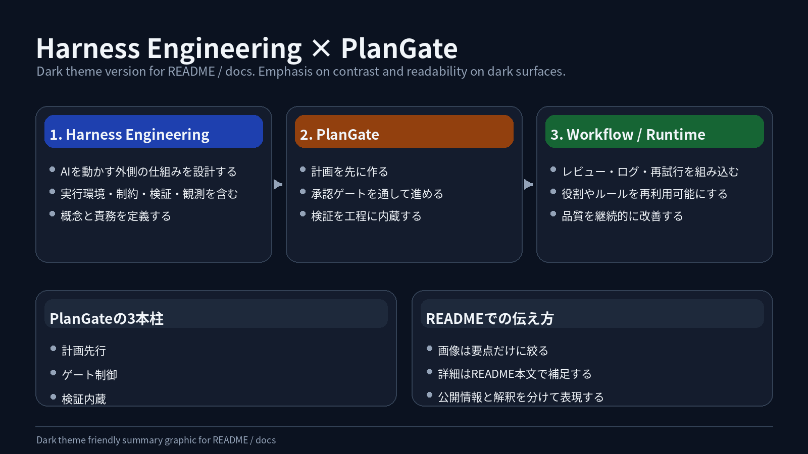

# PlanGate

PlanGate は、AI コーディングエージェントをプロダクション開発で扱うためのゲート型ワークフローです。

PlanGate は **「計画の精度が実装品質を方向づける」** という前提に立ち、まず高精度な計画を作り、それを承認ゲート（C-3 / C-4）と検証で守りながら実装まで漏らさず運びます。「計画を承認しないと AI は 1 行もコードを書けない」という関所モデルは、その計画品質を実装へ確実に着地させるための仕組みです。PBI から計画、承認、実装、検証、handoff までを構造化します（因果の正本: [PlanGate ガイド「品質の発生源は計画側にある」](./plangate.md#実装段階のwチェック)）。

## 新規利用者: 最初に読む 3 ページ

PlanGate を初めて知った方は、以下の順に **15-30 分** で読むことを推奨します。

1. **[PlanGate ガイド](./plangate.md)** — 全体像・5 フェーズ・解決する問題（約 5 分）
2. **[段階的導入ガイド (Phase 0 = 正本)](./staged-adoption-guide.md#phase-0-体験day-1)** — Level 1 (Day 1) から始める **30 分初回体験の正本**（約 10 分）
3. **[10 分チュートリアル（GitHub README）](https://github.com/s977043/PlanGate#10-分チュートリアル)** — 実際に手を動かす **短縮版**（約 10 分、正本 #2 への導線）

「自分のチームに合うか」を判断したい方は [思想と問題設定](./philosophy.md) と [When NOT to use](./when-not-to-use.md) を参照。略号 (EH-X / WF-XX / V-X / C-X) は [用語クイックリファレンス](./glossary.md) を参照。

## Requirements

| 種別 | ツール | 用途 |
| --- | --- | --- |
| **Required** | git / POSIX sh (bash/zsh) / python3 | `bin/plangate` CLI と hook の基盤 |
| **Recommended** | [Claude Code](https://docs.claude.com/claude-code) | plan 生成・exec の主導線（slash command 経由） |
| **Optional** | [gh CLI](https://cli.github.com/) | PR / issue 操作（C-4 ゲートの GitHub 連携） |
| **Optional** | [Codex CLI](https://github.com/openai/codex) | exec 実装エージェント（既定） / C-2 / V-3 外部レビュー |
| **Optional** | [Gemini CLI](https://github.com/google-gemini/gemini-cli) | 並列外部レビュー |
| **Optional** | [Cursor](https://cursor.com/) | `PLANGATE_IMPL_AGENT=cursor`（部分対応・[RFC](./rfc/provider-cursor.md)） |

OS: macOS / Linux（POSIX shell が動作する環境）。Windows は WSL 推奨。Claude Code を使わない場合は `bin/plangate` CLI のみで PBI 文書管理 + ゲート検証は可能ですが、plan 生成は手動になります。

## はじめに読むもの

| ドキュメント | 内容 |
| --- | --- |
| [公開ドキュメント入口][pages-index] | River-Reviewer 形式に寄せた `docs/pages/` 配下の公開説明ドキュメント |
| [Product Overview][product-overview] | PlanGate の概要、対象ユーザー、価値、仕組み |
| [PM / PO Elevator Pitch][pm-po-pitch] | PM / PO に PlanGate を説明するための短いピッチ、タグライン、定期見直し観点 |
| [思想と問題設定](./philosophy.md) | PlanGate が向き合う課題、ハーネスエンジニアリングとの関係 |
| [PlanGate ガイド](./plangate.md) | 全体像、フェーズ、運用手順 |
| [高品質な実行計画ができるまで](./pages/explanation/product/plan-creation-process.md) | PBI INPUT から C-3 承認まで、計画を生むプロセスの解説 |
| [v7 ハイブリッドアーキテクチャ](./plangate-v7-hybrid.md) | Governance × Modularity、Workflow / Skill / Agent 3 層 |
| [Orchestrator Mode 仕様](./orchestrator-mode.md) | 親 PBI 分解 / 子 PBI 並行実行 / 統合ゲートの仕様（v1, Spec only） |
| [Workflow 定義](./workflows/README.md) | WF-01〜WF-05 + Orchestrator Decomposition / Integration |
| [Harness Improvement Roadmap](./ai/harness-improvement-roadmap.md) | モデル差分・実利用データ・評価結果を使って PlanGate ハーネスを継続改善するロードマップ |
| [plugin 移行ガイド](./plangate-plugin-migration.md) | Claude Code / Codex plugin として使う場合の導入・移行・インストール（Marketplace 対応） |
| [OSS Governance](./oss-governance.md) | OSS 公開設定・運用判断 |
| [Changelog](./changelog.md) | リリース履歴（リリース時に自動同期: scripts/sync-release-docs.sh） |

## PlanGate の位置づけ

PlanGate は、一般的なハーネスエンジニアリングの考え方を PBI 単位の開発運用に落とし込むための仕組みです。

- Harness Engineering: AI を安全に動かす外側の仕組みを設計する
- PlanGate: 計画、承認ゲート、検証、handoff を PBI 単位で固定する
- Workflow / Runtime: レビュー、ログ、再試行、役割分担を実行層として組み込む

## 中核アイデア

計画先行を起点に、ゲート制御・検証内蔵がその計画品質を実装まで保ちます。一覧の各項目は等価ではなく、**計画先行が品質の発生源、ほかはその品質を漏らさない保全**という関係です。

| アイデア | 内容 |
| --- | --- |
| 計画先行 | 実装前に plan / todo / test-cases を作り、承認前の実装を止める |
| ゲート制御 | C-3 と C-4 で人間の判断点を固定する |
| 検証内蔵 | L-0 / V-1〜V-4 により、検証をワークフローに含める |
| 状態の永続化 | チケット単位で計画、レビュー、検証、handoff を残す |
| 実行層の分離 | Workflow / Skill / Agent を分け、再利用性と拡張性を高める |

## ドキュメント配置について

公開説明ドキュメントは River-Reviewer を参考に `docs/pages/` 配下で管理しています。

`docs/` は開発者向け runbook、内部運用、workflow 定義、作業ログを中心に扱います。

`docs/working/` 配下にはチケット単位の作業コンテキストやレビュー記録が含まれるため、公開サイトの主要導線には含めません。

[pages-index]: ./pages/index.md
[product-overview]: ./pages/explanation/product/overview.md
[pm-po-pitch]: ./pages/explanation/product/pm-po-elevator-pitch.md
